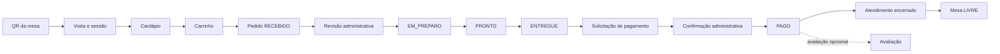
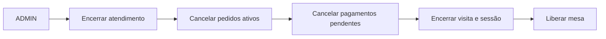

# Ditus

**Sistema Full Stack para Gestão de Pedidos e Atendimento em Restaurantes**

Ditus é uma aplicação web que integra a jornada do cliente à operação do restaurante. O sistema oferece cardápio digital, pedidos e acompanhamento em tempo real, pagamentos e avaliações, além de um ambiente autenticado para funcionários administrarem mesas, atendimentos, pedidos e indicadores.

## Sobre o projeto

O projeto resolve a fragmentação entre cardápio, atendimento da mesa e operação interna. O cliente entra pelo QR Code de uma mesa ou inicia uma visita que será associada por um funcionário, monta o carrinho, envia pedidos e acompanha cada etapa sem recarregar a página.

No ambiente administrativo, funcionários autenticados acompanham mesas, visitas e pedidos, revisam pedidos ainda recebidos, encaminham itens à cozinha, alteram status e tratam solicitações de pagamento. Administradores também podem confirmar pagamentos, encerrar atendimentos emergencialmente, manter o cardápio e consultar vendas, produtos e avaliações. Os dados são persistidos em PostgreSQL por meio do Supabase.

## Objetivos

- Digitalizar o atendimento desde a identificação da mesa até sua liberação.
- Dar ao cliente autonomia para consultar o cardápio, pedir, acompanhar, solicitar pagamento e avaliar.
- Centralizar a operação de salão, cozinha e administração em um painel protegido.
- Manter regras de negócio, histórico e transições consistentes no servidor e no banco.
- Exercitar uma arquitetura full stack com autenticação, RLS, Realtime, Storage, idempotência e testes automatizados.

## Principais funcionalidades

### Cliente

- Cardápio por categorias, com produtos ativos, detalhes, imagens e suporte a português, inglês e espanhol.
- Entrada direta pelo contexto seguro da mesa/QR ou entrada convencional com posterior associação por um funcionário.
- Carrinho persistido no navegador, quantidades, observações e confirmação antes do envio.
- Criação idempotente e acompanhamento do pedido por token próprio.
- Atualização em tempo real dos estados do pedido e da visita.
- Solicitação de pagamento por PIX, cartão ou dinheiro.
- Avaliação com nota e comentário após a confirmação do pagamento.
- Recuperação segura após encerramento completo: remove o estado anterior e preserva somente o contexto físico do QR.

### Administração / Funcionários

- Autenticação com Supabase Auth e autorização por perfil ativo em `staff_profiles`.
- Painel com mesas, fila de visitas, pedidos e estado da conexão em tempo real.
- Associação de clientes em espera a mesas livres.
- Consulta e revisão de itens e observações enquanto o pedido está em `RECEBIDO`.
- Envio para cozinha com impressão pelo navegador e avanço controlado de status.
- Notificações Realtime para pedidos, revisões, visitas, pagamentos e mudanças operacionais.
- Confirmação administrativa de pagamentos e conclusão do pedido.
- Encerramento emergencial com cancelamento de pedidos ativos e pagamentos pendentes, encerramento da visita/sessão e liberação da mesa, sem apagar o histórico.
- CRUD de produtos, com desativação lógica, traduções e upload de JPG, PNG ou WebP no Supabase Storage.
- Relatório de pedidos pagos e faturamento por período/mesa, ticket médio e impressão.
- Indicadores de avaliações, comentários recentes e produtos mais vendidos.

## Fluxo do atendimento

Fluxo normal:



O início também pode ocorrer pela fila: o cliente registra uma visita e um funcionário associa uma mesa livre antes do envio do pedido. A confirmação como `PAGO` encerra o atendimento e libera a mesa; em seguida, a interface oferece a avaliação opcional do pedido pago.

Encerramento emergencial, separado do fluxo normal:



## Arquitetura

```text
Cliente / Funcionário
          ↓
        Next.js
          ↓
  Route Handlers / API
          ↓
    Server Services
          ↓
       Supabase
          ↓
      PostgreSQL
```

Frontend e backend convivem no Next.js. Route Handlers validam entradas e direcionam operações críticas a serviços server-side e funções transacionais do PostgreSQL. O Supabase fornece PostgreSQL, Auth, Realtime e Storage. O navegador usa somente a chave publicável; a chave secreta/service-role permanece no servidor.

Consulte [docs/architecture.md](docs/architecture.md) para relacionamentos, limites de acesso e detalhes arquiteturais.

## Tecnologias

Versões declaradas no `package.json`:

| Camada | Tecnologias |
| --- | --- |
| Frontend | Next.js 16.3, React 19.2, TypeScript 5.9, Tailwind CSS 3.4 |
| Backend | Next.js Route Handlers, Supabase JS 2.95, Supabase SSR 0.6, Zod 4.4 |
| Banco | PostgreSQL e funções PL/pgSQL |
| Infraestrutura | Supabase, Netlify e GitHub |
| Testes e qualidade | Vitest 3.2, Playwright 1.55, pgTAP, ESLint 9 e TypeScript |

O projeto usa `qrcode` 1.5 para gerar o QR de pagamento PIX configurado pelo servidor.

## Banco de dados

- `categories`: categorias traduzíveis do cardápio.
- `products`: produtos, preços, descrições, imagens e disponibilidade.
- `restaurant_tables`: mesas físicas, estado operacional e credencial de acesso.
- `customer_visits`: ciclo de visita do cliente e token de acompanhamento.
- `table_sessions`: atendimento aberto ou encerrado de uma mesa.
- `orders`: pedido, estado, total, chave de idempotência e token de acompanhamento.
- `order_items`: itens com nome e preço congelados no momento da criação.
- `staff_profiles`: vínculo do usuário do Auth com papel e estado de acesso.
- `payment_requests`: solicitação, método e confirmação do pagamento.
- `order_reviews`: nota e comentário, limitados a uma avaliação por pedido.

Uma categoria possui produtos; uma mesa acumula sessões; uma visita ativa se liga a uma sessão, que agrega pedidos; cada pedido possui itens e pode possuir uma solicitação de pagamento e uma avaliação.

## Estados do pedido

```text
RECEBIDO → EM_PREPARO → PRONTO → ENTREGUE → AGUARDANDO_PAGAMENTO → PAGO
```

`CANCELADO` é terminal e excepcional. No fluxo comum, somente pedidos `RECEBIDO` ou `EM_PREPARO` podem ser cancelados. O encerramento emergencial pode cancelar qualquer pedido ativo da sessão. Não existem saltos ou retorno; `AGUARDANDO_PAGAMENTO` é alcançado ao solicitar pagamento e `PAGO` apenas pela confirmação administrativa.

## Mesas e sessões

A mesa representa o recurso físico. `customer_visits` representa a jornada da pessoa, enquanto `table_sessions` delimita a ocupação da mesa e agrupa pedidos. Um índice parcial impede mais de uma sessão `ABERTA` por mesa, e funções transacionais validam sua disponibilidade.

Quando todos os pedidos chegam a estado terminal, sessão e visita são encerradas e a mesa volta a `LIVRE`. O encerramento emergencial é exclusivo de `ADMIN`, cancela registros pendentes, encerra o ciclo ativo e preserva o histórico.

## QR Code / acesso por mesa

A entrada usa `/mesa/[number]?token=...`. Cada QR representa uma mesa física e inclui uma credencial opaca, validada no servidor por hash. O número isolado não basta para iniciar o atendimento.

A credencial identifica o acesso à mesa; visita e sessão identificam o atendimento. Ao encerrar o ciclo, um novo atendimento recebe nova visita, sessão, token de cliente e chave de idempotência, sem reutilizar o estado anterior. Nenhum token real é documentado aqui.

## Pagamentos

Os métodos suportados são `PIX`, `CARTAO` e `DINHEIRO`. O cliente solicita pagamento quando o pedido está entregue; para PIX, pode receber o BR Code configurado pelo servidor e informar que realizou a transferência. Cartão e dinheiro geram uma solicitação de atendimento.

Solicitar ou informar pagamento não torna o pedido pago. Somente um administrador autenticado confirma o recebimento; a função transacional confirma `payment_requests` e move o pedido para `PAGO`. Não há gateway bancário nem confirmação automática.

## Realtime

Supabase Realtime atualiza o acompanhamento do cliente quando pedido, visita ou pagamento muda. No painel, canais autenticados observam pedidos, mesas, visitas e pagamentos, atualizam a interface e produzem notificações sem refresh manual. Não há mensageria externa.

## Segurança

- Supabase Auth autentica funcionários; `staff_profiles` determina papel, ativação e acesso.
- RLS restringe leitura direta e deixa publicamente visíveis apenas categorias e produtos ativos.
- Mutações passam por Route Handlers, Zod, serviços server-side e funções com permissões explícitas.
- A chave secreta/service-role não é exposta ao navegador.
- Tokens opacos protegem mesa, visita e acompanhamento; credenciais são comparadas por hash quando aplicável.
- Confirmar pagamento e forçar encerramento exigem papel `ADMIN` ativo.

## Idempotência

A criação exige uma `idempotency key` UUID única. Ela representa uma tentativa lógica: repetições recuperam o pedido criado em vez de duplicá-lo. Depois do sucesso, de uma nova tentativa intencional ou da reinicialização do atendimento, uma nova chave é gerada.

## Bug importante identificado durante testes

Um smoke test de produção revelou um problema de lifecycle: depois de o `ADMIN` encerrar um atendimento, o navegador ainda conservava parte do estado anterior e sua chave de idempotência. Uma nova tentativa podia recuperar o pedido anteriormente `CANCELADO`.

O problema foi corrigido com reset centralizado, limpeza do estado persistido, nova chave de idempotência e distinção entre cancelamento individual e encerramento integral. O contexto físico do QR é preservado, enquanto cliente, visita, sessão e pedido são renovados. Um cenário E2E protege a regressão.

O aprendizado foi que idempotência depende do limite correto do ciclo de vida: uma chave só é segura enquanto representa a mesma intenção de negócio. Estado do navegador, identidade do atendimento e regras transacionais precisam ser invalidados de forma coordenada.

## Testes

| Verificação | Comando | Escopo |
| --- | --- | --- |
| Unitários | `npm test` | Transições, lifecycle, schemas e notificações |
| Banco / pgTAP | `npm run test:db` | Pedidos, visitas, QR, pagamentos, avaliações e encerramento |
| E2E / Playwright | `npm run test:e2e` | Jornadas de cliente e administração |
| Tipos | `npm run typecheck` | TypeScript sem emissão |
| Lint | `npm run lint` | Análise com ESLint |
| Build | `npm run build` | Compilação de produção |

Testes de banco requerem Supabase local. O E2E completo requer migrations, seed, variáveis de ambiente, `E2E_SUPABASE_READY=1` e credenciais descartáveis da fixture local.

## CI/CD e Deploy

```text
feature branch → commit → push → Pull Request → checks/deploy preview
       → merge aprovado → main → deploy de produção
```

`main` é a branch de produção. O Netlify está conectado a ela: Pull Requests podem gerar previews e merges aprovados disparam o deploy de produção. O desenvolvimento utiliza branches `feature/*` e `fix/*`; `develop` pode servir como integração.

## Variáveis de ambiente

Crie `.env.local` a partir de `.env.example`:

| Variável | Exposição | Finalidade |
| --- | --- | --- |
| `NEXT_PUBLIC_SUPABASE_URL` | Pública | URL da API Supabase |
| `NEXT_PUBLIC_SUPABASE_PUBLISHABLE_KEY` | Pública | Chave publicável/anon para Auth e Realtime |
| `SUPABASE_SECRET_KEY` | Somente servidor | Operações server-side privilegiadas |
| `PIX_PAYLOAD` | Somente servidor | BR Code/Pix Copia e Cola |
| `PLAYWRIGHT_BASE_URL` | Opcional/testes | URL base do Playwright |

Nunca use `NEXT_PUBLIC_` em secrets. `E2E_SUPABASE_READY`, `E2E_ADMIN_EMAIL` e `E2E_ADMIN_PASSWORD` são usados apenas pela suíte E2E e não devem conter credenciais de produção.

## Como executar localmente

Pré-requisitos: Node.js compatível com Next.js 16, npm, Docker e Supabase CLI para a pilha local.

1. Clone o repositório e acesse a pasta:

   ```bash
   git clone <URL_DO_REPOSITORIO>
   cd Ditus
   ```

2. Instale dependências com `npm install`.
3. Copie `.env.example` para `.env.local`, preencha o ambiente e não versione o arquivo.
4. Inicie o Supabase local com `npx supabase start`.
5. Em uma instância **local descartável**, aplique migrations e seed com `npx supabase db reset`. Esse comando recria somente o banco local; nunca o execute apontando para um projeto remoto. Em ambiente remoto, use o processo controlado da equipe para aplicar migrations e seed quando apropriado.
6. Crie um usuário no Supabase Auth e vincule seu UUID a um `staff_profiles` ativo. Use papel `ADMIN` para as operações completas.
7. Inicie a aplicação com `npm run dev`.

## Estrutura principal

```text
src/app/              Páginas, layouts e Route Handlers
src/components/       Interfaces de cliente e funcionário
src/hooks/            Estado, carrinho e inscrições Realtime
src/lib/              Regras, validação, Auth e Supabase
src/server/           Serviços executados no servidor
src/types/            Tipos do domínio e banco
supabase/migrations/  Schema, funções e RLS
supabase/tests/       Testes pgTAP
tests/e2e/            Jornadas com Playwright
docs/                 Documentação complementar
```

## Decisões técnicas

- Next.js full stack integra interface e API sem expor lógica privilegiada.
- TypeScript e Zod reforçam contratos estáticos e em runtime.
- PostgreSQL/Supabase concentra persistência, transações, Auth, RLS, Realtime e Storage.
- Operações críticas são server-side e transacionais.
- Estados explícitos tornam o ciclo auditável e impedem transições inválidas.
- Idempotência protege contra duplo envio.
- Mesa, visita, sessão e pedido são entidades distintas.
- Cancelamentos preservam histórico em vez de apagar pedidos.

## Limitações atuais / Roadmap

- Integração real com gateway/PSP para PIX e demais pagamentos.
- Impressora térmica dedicada; hoje a impressão usa o navegador.
- Controle de estoque e disponibilidade por insumo.
- Integração fiscal.
- Observabilidade, auditoria operacional e monitoramento ampliados.
- Permissões mais específicas por papel (`ATENDENTE`, `COZINHA` e `ADMIN`) nas operações que hoje aceitam qualquer perfil ativo.

## Histórico de desenvolvimento / Aprendizados

Ditus evoluiu de uma interface/protótipo navegável para um sistema full stack persistente. A evolução envolveu modelagem relacional, migrations, Auth e RLS, APIs server-side, Realtime, Storage, idempotência e testes unitários, de banco e ponta a ponta. O debugging do lifecycle em produção reforçou a importância de testar limites de sessão, estado do navegador e falhas entre camadas, além do fluxo de CI/CD.

## Autor

Aline Lima
